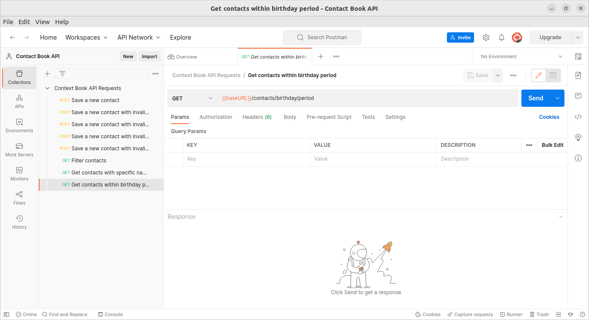

# contact-book-api

## Sumário

- [contact-book-api](#contact-book-api)
  - [Sumário](#sumário)
  - [Motivação](#motivação)
  - [Pilha de tecnologia](#pilha-de-tecnologia)
  - [Galeria](#galeria)
  - [Como rodar](#como-rodar)
    - [Pré-requisitos](#pré-requisitos)
    - [Passo a passo](#passo-a-passo)

## Motivação

Este app consiste em uma API de uma agenda telefônica.

A agenda armazena o nome, o endereço de e-mail, o número de telefone e a data de nascimento de um contato; sendo facultativo apenas o endereço de e-mail. O arquivo [`contact-book-api-requests.postman_collection.json`](./docs/contact-book-api-requests.postman_collection.json), presente no diretório [`docs/`](./docs/), é uma coleção de requisições e testes de API solicitada para a primeira atividade avaliativa da unidade curricular. A coleção contém quatro requisições para salvar novos contatos com diferentes tipos de erros de validação. Cada requisição contém um script de teste que garante que a resposta da API corresponda ao resultado esperado para o erro de validação fornecido. As quatro requisições da coleção consistem em:

1. Salvar um novo contato com dados de entrada válidos. O script de teste verifica se o status da resposta é 201 e se o objeto de contato retornado possui uma propriedade `_id` não nula;

2. Impedir que um contato com um nome vazio seja salvo. O script de teste verifica se o status da resposta é 400 e se a mensagem de erro é "Nome não pode estar vazio";

3. Impedir que um contato com um e-mail inválido seja salvo. O script de teste verifica se o status da resposta é 400 e se a mensagem de erro é "E-mail inválido";

4. Impedir que um contato com um número de telefone inválido seja salvo. O script de teste verifica se o status da resposta é 400 e se a mensagem de erro é "Número de telefone inválido".

Este foi o segundo repositório de código apresentado no [Curso Superior de TSI do IFMS](https://www.ifms.edu.br/campi/campus-aquidauana/cursos/graduacao/sistemas-para-internet/sistemas-para-internet) como requisito para obtenção da nota parcial das atividades da unidade curricular Linguagem de Programação III.

| [&larr; Repositório anterior](https://github.com/mdccg/aquecimento-api) | [Próximo repositório &rarr;](#) |
|-|-|

## Pilha de tecnologia

As seguintes tecnologias foram utilizadas para desenvolver este app:

| Papel | Tecnologia |
|-|-|
| Ambiente de execução | [Node](https://nodejs.org/en/) |
| Linguagem de programação | [TypeScript](https://www.typescriptlang.org/) |
| Back-end | [Express.js](https://expressjs.com/pt-br/) |
| Framework de teste | [Postman](https://www.postman.com/) |
| Virtualização de banco de dados | [Docker](https://www.docker.com/) |
| Banco de dados | [MongoDB](https://www.mongodb.com/) |

## Galeria



## Como rodar

### Pré-requisitos

- [Node](https://nodejs.org/en/download/);
- [Yarn](https://yarnpkg.com/) (opcional);
- [Postman](https://www.postman.com/) (opcional).

### Passo a passo

1. Clone o repositório de código em sua máquina;

2. Abra um shell de comando de sua preferência (prompt de comando, PowerShell, terminal _etc_.);

3. Instale as dependências do projeto através do seguinte comando:

```console
$ npm install
```

Caso esteja utilizando o gerenciador de pacotes Yarn, execute o seguinte comando como alternativa:

```console
$ yarn
```

4. Execute o seguinte comando para iniciar o app:

Para npm:

```console
$ npm run dev
```

Para Yarn:

```console
$ yarn dev
```

5. Abra o Postman e importe o arquivo de coleção Postman [`contact-book-api-requests.postman_collection.json`](./docs/contact-book-api-requests.postman_collection.json) para executar os testes unitários dos serviços de consulta;

Como alternativa ao Postman, você pode instalar as dependências globais [`newman`](https://npmjs.com/package/newman) e [`newman-reporter-htmlextra`](https://npmjs.com/package/newman-reporter-htmlextra) para gerar relatórios sobre o arquivo em questão via interface de linha de comando e interface gráfica do usuário, respectivamente.